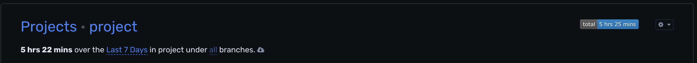
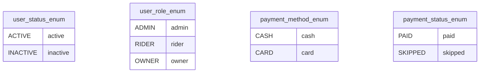
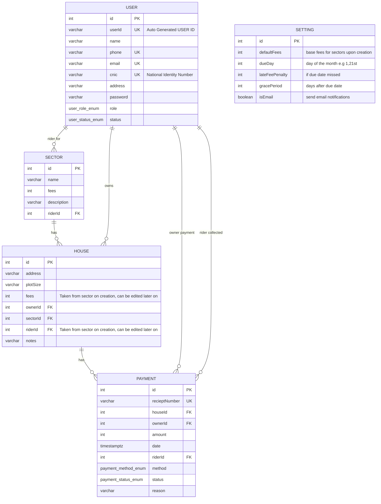

<!--START_SECTION:waka-->
<!--END_SECTION:waka-->

## Time Logging

[playgroundRepo](https://github.com/tauheedbuttt/testing-nx) = 1h 50m  
currentTime in this repo = 8h 37m  
totalTime = 10h 27m

## ENUMS

## ERD

