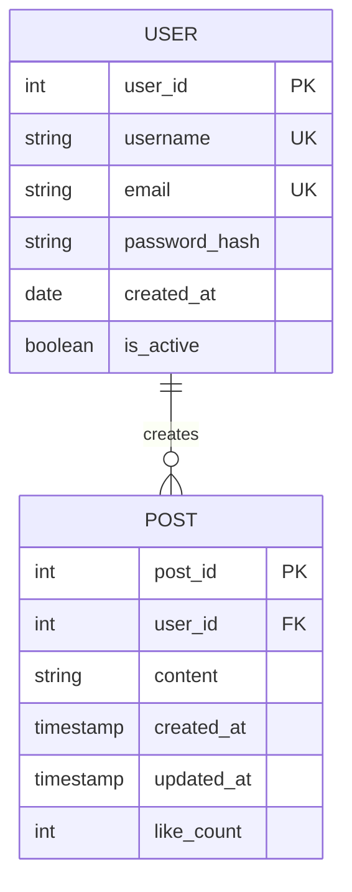

```mermaid

erDiagram
    USER {
        int user_id PK
        string username UK
        string email UK
        string password_hash
        date created_at
        boolean is_active
    }

    POST {
        int post_id PK
        int user_id FK
        string content
        timestamp created_at
        timestamp updated_at
        int like_count
    }

    USER ||--o{ POST : creates
```
