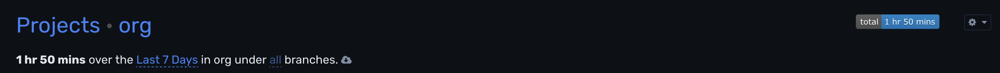
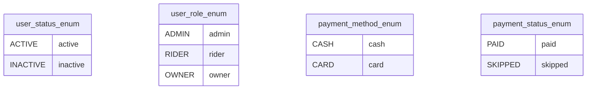
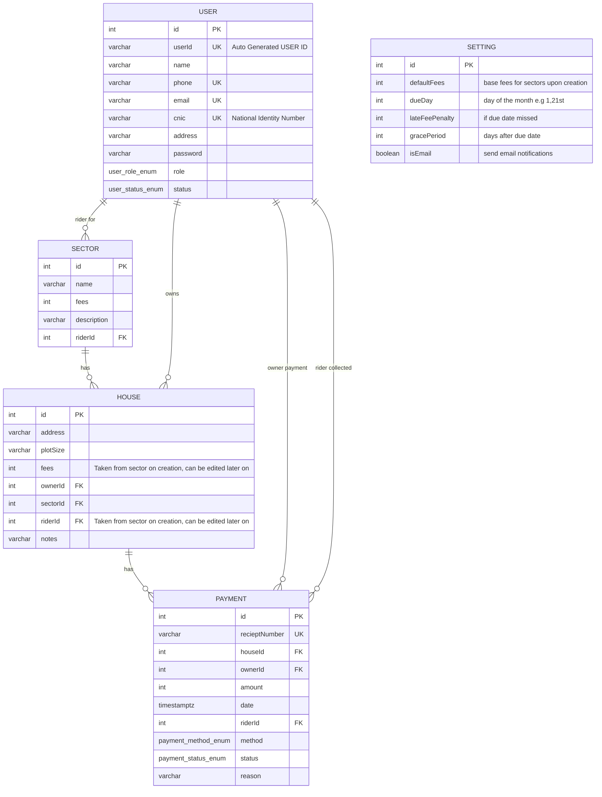

## Time Logging

```
    currentTime in this repo = 2h 16m
    [playgroundRepo](https://github.com/tauheedbuttt/testing-nx) = 1h 50m
    

    totalTime = 4h 6m
```

## ENUMS


```mermaid

erDiagram
    user_status_enum {
        ACTIVE active
        INACTIVE inactive
    }
    user_role_enum {
        ADMIN admin
        RIDER rider
        OWNER owner
    }
    payment_method_enum {
        CASH cash
        CARD card
    }
    payment_status_enum {
        PAID paid
        SKIPPED skipped
    }
```

## ERD


```mermaid

erDiagram
    USER {
        int id PK
        varchar userId UK "Auto Generated USER ID"
        varchar name
        varchar phone UK
        varchar email UK
        varchar cnic UK "National Identity Number"
        varchar address
        varchar password
        user_role_enum role
        user_status_enum status
    }

    HOUSE {
        int id PK
        varchar address
        varchar plotSize
        int fees "Taken from sector on creation, can be edited later on"
        int ownerId FK
        int sectorId FK
        int riderId FK "Taken from sector on creation, can be edited later on"
        varchar notes
    }

    SECTOR {
        int id PK
        varchar name
        int fees
        varchar description
        int riderId FK
    }

    PAYMENT {
        int id PK
        varchar recieptNumber UK
        int houseId FK
        int ownerId FK
        int amount
        timestamptz date
        int riderId FK
        payment_method_enum method
        payment_status_enum status
        varchar reason
    }

    SETTING {
        int id PK
        int defaultFees "base fees for sectors upon creation"
        int dueDay "day of the month e.g 1,21st"
        int lateFeePenalty "if due date missed"
        int gracePeriod "days after due date"
        boolean isEmail "send email notifications"
    }

    USER ||--o{ SECTOR: "rider for"
    SECTOR ||--o{ HOUSE : has

    USER ||--o{ HOUSE: owns
    HOUSE ||--o{ PAYMENT: has
    USER ||--o{ PAYMENT: "owner payment"
    USER ||--o{ PAYMENT: "rider collected"
```
