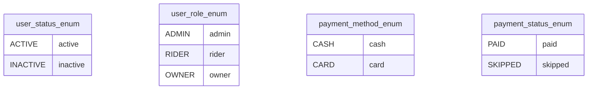
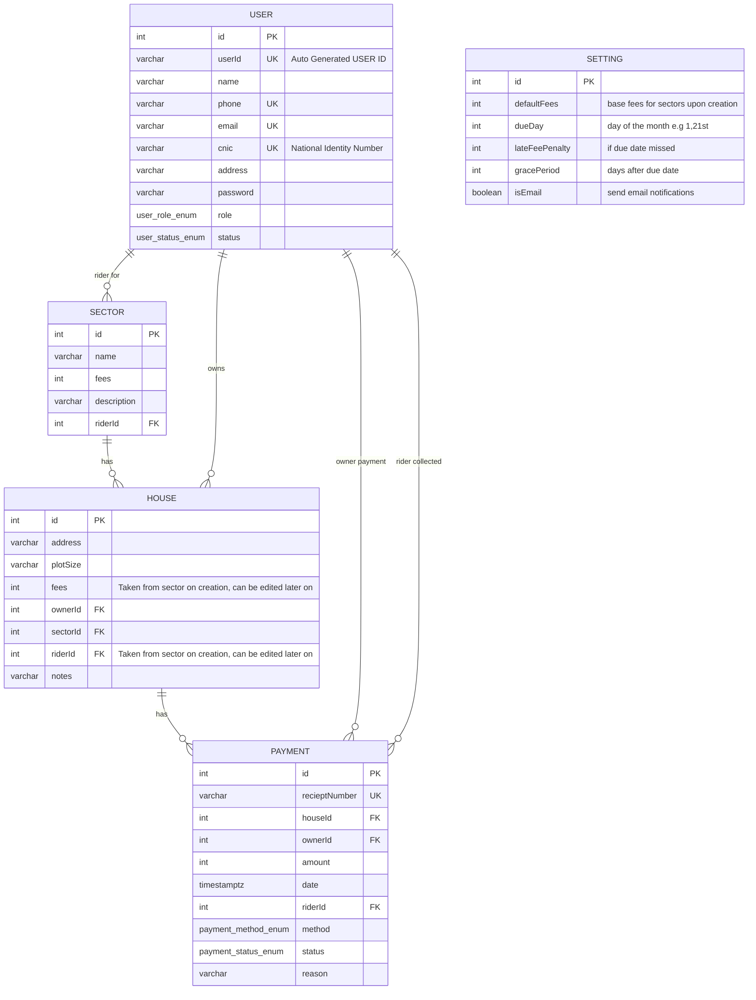

# Mobile Collection Manager

Welcome to Mobile Collection Manager — a full-stack, monorepo-based platform for automating and managing payment collection in housing societies, sectors, and property ownership contexts.

---

## 🚦 Monorepo Structure & Technologies

**This project is organized as a monorepo using [NX](https://nx.dev)**, which provides advanced tooling for managing multiple applications and shared code under a single repository:

- **Monorepo Tooling:** [NX](https://nx.dev) (workspace orchestration, code sharing, dependency graph, generators)
- **Location of apps/packages:**  
  &nbsp;&nbsp;`/apps/dashboard` — Admin web dashboard  
  &nbsp;&nbsp;`/apps/mobile` — Rider mobile app  
  &nbsp;&nbsp;`/apps/backend` — Backend API  
  &nbsp;&nbsp;`/shared` — Shared TypeScript types, interfaces, and utilities

### Stack Overview

| Layer               | Technology                                  |
| ------------------- | ------------------------------------------- |
| **Monorepo**        | NX                                          |
| **Frontend**        | React (dashboard, TypeScript, TailwindCSS)  |
| **Mobile**          | React Native (TypeScript, Redux Toolkit)    |
| **Backend**         | NestJS (TypeScript, PostgreSQL, TypeORM)    |
| **Forms**           | Formik, Yup                                 |
| **API**             | Axios (frontend), OpenAPI/Swagger (backend) |
| **Styling**         | Tailwind CSS (dashboard and mobile)         |
| **Auth**            | JWT (backend)                               |
| **Validation**      | class-validator (backend), Yup (frontend)   |
| **CI/CD & Tooling** | Docker, Husky, ESLint, Prettier             |

---

## 📖 Project Purpose & Overview

Mobile Collection Manager enables:

- **Admins** to assign sectors, manage users, audit collections, and monitor real-time payment statuses.
- **Riders** to record collections, skip or partially collect (with reason logging), and follow assigned routes via a tailored mobile experience.
- **Owners** to track their individual payments and receipts.

Supports multiple payment methods (cash, card, skipped), robust audit trails, and flexible user roles (admin, rider, owner).

### Key Features

- Digital payment and receipt recording per property
- Skipping and partial collections with reason awareness
- Simple but thorough admin controls for assignments and allocation
- Detailed, auditable transaction history
- Responsive mobile application for field riders
- Secure, role-based authentication and access for all users

See [Project Documentation](./docs/USAGE.md) for advanced flow and usage.

---

## 📊 Entity Relationship Diagram (ERD)

### ENUMS

### Core Data Model

---

## 🚀 Quick Start & Usage

See [USAGE.md](./docs/USAGE.md) for workspace setup, app usage, and development instructions.

For demo requests or issues, please contact the maintainer.

---

## 🔗 Other Repositories

_Single repository monorepo project under NX. If modularized or split, links will appear here._

---
